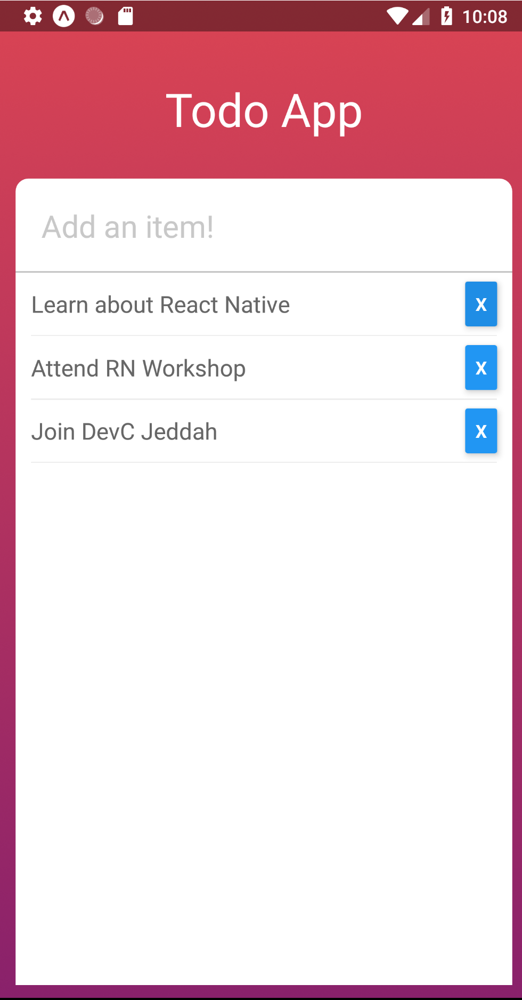

# Introduction To React Native: Workshop

React Native lets you build mobile apps using only JavaScript. It uses the same design as 
React, letting you compose a rich mobile UI using declarative components.

A React Native app is a real mobile app. The apps you are building with React Native 
aren't mobile web apps because React Native uses the same fundamental UI building blocks 
as regular iOS and Android apps. Instead of using Swift, Kotlin or Java, you are putting 
those building blocks together using JavaScript and React.

In this workshop, we will learn how to build a component-based todo mobile-app using React 
Native.




## Requirements

Please make sure, you've the following items installed on your laptop before the event, 
for the workshop.

1. Node v9.4+, NPM v6.7+, Yarn v1.13+

   - [Installing Node.js via package manager](https://nodejs.org/en/download/package-manager/)
   - [Installing Yarn](https://yarnpkg.com/en/docs/install)

2. Node Dependencies

   Install the **expo-cli** dependence.

   ```bash
   npm install expo-cli --global
   ```

3. Code Editor, of your choice

For anyone, who needs a refresher on JavaScript. I recommend you read the excellent 
[Re-introduction guide to JavaScript]( 
https://developer.mozilla.org/en-US/docs/Web/JavaScript/A_re-introduction_to_JavaScript).


## Workshop

Please run `yarn install` to install the project dependancies before getting started.

- **Starting Version**

  Use the `master` branch to start building out the app.

- **Completed Version**

  The completed version is the end product we'll be working towards. You can get a 
  look at it by checking out the `completed` branch.


## Notes & Reference

- [ReactJS Quick Start](https://reactjs.org/docs/hello-world.html)

  If you haven't used ReactJS or React Native. Once you're through the workshop code. I 
  highly recommend going through the Quick Start guide for ReactJS.

- [The Beginner's Guide to ReactJS](https://egghead.io/courses/the-beginner-s-guide-to-reactjs) _(Video Course)_

### JavaScript Reference

- [let](https://developer.mozilla.org/en-US/docs/Web/JavaScript/Reference/Statements/let)
- [const](https://developer.mozilla.org/en-US/docs/Web/JavaScript/Reference/Statements/const)
- [arrow function](https://developer.mozilla.org/en-US/docs/Web/JavaScript/Reference/Functions/Arrow_functions)
- [Classes](https://developer.mozilla.org/en-US/docs/Web/JavaScript/Reference/Classes)
- [Template literals](https://developer.mozilla.org/en-US/docs/Web/JavaScript/Reference/Template_literals)
- [Array.map()](https://developer.mozilla.org/en-US/docs/Web/JavaScript/Reference/Global_Objects/Array/map)


## What's Next?

- Learn More
- Build something, anything!
- Share it with [the community](https://www.facebook.com/groups/DevCJeddah/)

**Happy Hacking! :)**
